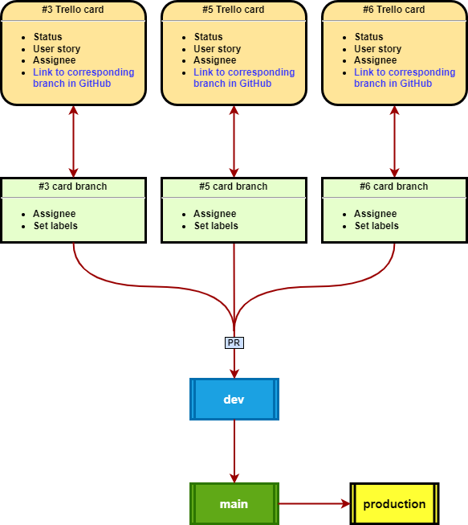
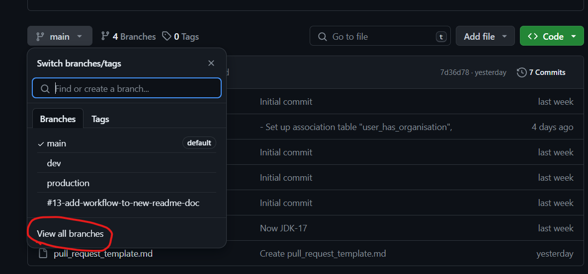
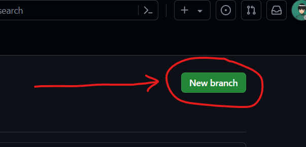
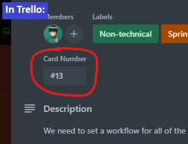
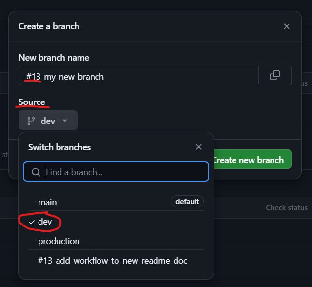
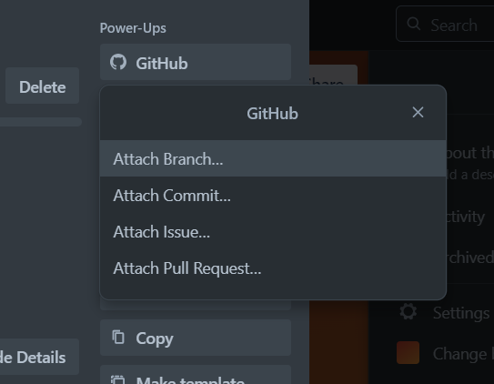

<!-- START doctoc generated TOC please keep comment here to allow auto update -->
<!-- DON'T EDIT THIS SECTION, INSTEAD RE-RUN doctoc TO UPDATE -->

**Table of Contents** _generated with [DocToc](https://github.com/thlorenz/doctoc)_

- [Jambiz Alumni Portal](#jambiz-alumni-portal)
  - [1. Description](#1-description)
  - [2. Our Workflow](#2-our-workflow)
    - [2.1 Trello & GitHub](#21-trello--github)
    - [2.2 Time for a PR](#22-time-for-a-pr)
  - [3.How to Run Application](#3setting-up-application)
    - [3.1 Software Requirements](#31-Software-Requirements)
    - [3.2 Steps](#32-Steps)

<!-- END doctoc generated TOC please keep comment here to allow auto update -->

# Jambiz Alumni Portal

## 1. Description

This projects task is to develop the **_Jambiz Alumni Portal_** - a web platform that aims to connect current and  
former members of the organisations within the Jambiz Group.  
It will enable networking, professional development and information exchange between members of the platform.

## 2. Our Workflow

We use two GitHub repos:

- [alumni-portal-backend](https://github.com/PLUPPERT/alumni-portal-backend)
- [alumni-portal-frontend](https://github.com/PLUPPERT/alumni-portal-frontend)

Both repos has three permanent branches each:

- main
- dev
- production

As of now we make use of the **_main_** and **_dev_** branches. The **_production_** branch is there for when the  
portal is ready to go online.

### 2.1 Trello & GitHub

&rarr; In [Trello](https://trello.com/b/TJcCXBQg/alumni-project):

> &emsp; - Pick an assigned card from "**Sprint**" or "**Backlog**" and move it to "**In Progress**"

&rarr; In GitHub:

> &emsp; - Create a new branch derived from **_dev_**
>
> &emsp;   
> &emsp; 
>
> &emsp; - give the branch a name describing its purpose and prefixed with its  
> &emsp; corresponding Trello Cards card number:
>
> &emsp;   
> &emsp; 
>
> Example:
>
> > #13-my-new-branch

&rarr; In Trello:

> &emsp; - Open the card. Go to:  
> &emsp; &emsp; &rarr; Power-Ups  
> &emsp; &emsp; &emsp; &rarr; GitHub  
> &emsp; &emsp; &emsp; &emsp; &rarr; Attach Branch...
>
> 
>
> &emsp; - ... and choose the recently created branch.

&rarr; In your local repository:

> &emsp; - Fetch and pull the **_new_** branch to your local repo  
>  &emsp; - Start working in the **_new_** branch  
>  &emsp; - All commits and pushs are made to the **_new_** branch until it's ready for a PR and code review

### 2.2 Time for a PR

&rarr; In your local repo:

> &emsp; - Pull the latest version of the GitHub remote **_dev_** branch and merge it into your local **_new_** branch  
> &emsp; - Commit and push your locally merged **_new_** branch to the corresponding GitHub remote branch

&rarr; In GitHub:

> &emsp; - Create a PR from your **_new_** branch to the **_dev_** branch  
> &emsp; &emsp; - If needed, make edits to the default PR template, that corresponds to your PR  
> &emsp; &emsp; - Follow the guidelines given in the PR template and fulfill the requirements, and then:  
> &emsp; &emsp; &emsp; - assign a code reviewer

&rarr; In Trello:

> &emsp; - Move the card from "**In Progress**" to "**Ready For Review**"

&rarr; In GitHub:

> &emsp; - When all requirements have been met and the code reviewer has approved of the PR:  
> &emsp; &emsp; - merge your **_new_** branch with the **_dev_** branch  
> &emsp; - Make sure everything is OK in **_dev_** branch  
> &emsp; &emsp; - If not OK:  
> &emsp; &emsp; &emsp; - start troubleshooting and try to solve it  
> &emsp; &emsp; - If it is OK:  
> &emsp; &emsp; &emsp; - tag the **_new_** branch as "archived" and then delete it
>
> > &emsp; &emsp; `git tag archive/<branchname> <branchname>`  
> > &emsp; &emsp; `git branch -d <branchname>`
>
> &emsp; &emsp; - If for some reason the branch would be needed again it can be restored:
>
> > &emsp; &emsp; `git checkout -b <branchname> archive/<branchname>`

&rarr; And finally:

> &emsp; - During the mornings daily stand-up the finished card is moved from **"Code Review"** to **"Done"**
>
> &emsp; &nbsp;&nbsp; by the acting Scrum Master
> 
> &emsp; - If your work day isn't over and there is more to be done,
> 
> &emsp; &nbsp;&nbsp; while you leave your finished card in the **"Code Review"** lane until next days daily stand-up:
> 
> &emsp; &emsp; - Pick a new card and repeat 🙃

## 3.Setting up Application

### 3.1-Software-Requirements
1. Intellij Idea
2. Node.js
3. git

### 3.2-Steps

1. Go to the GitHub repo and copy the url to clone : 
> &emsp;[alumni-portal-frontend](https://github.com/PLUPPERT/alumni-portal-frontend)

2. From terminal or command prompt run the command.
> &emsp; git clone <repo-url-here>

3. Open the project created above in Intellij and switch to dev branch using below command
> &emsp; git checkout dev

4. From a new terminal window, give the below command to get all the dependencies
> &emsp; npm install

5. To start the application.
> &emsp; npm start

6. This brings up the front end application at
> &emsp; http://localhost:3000/

